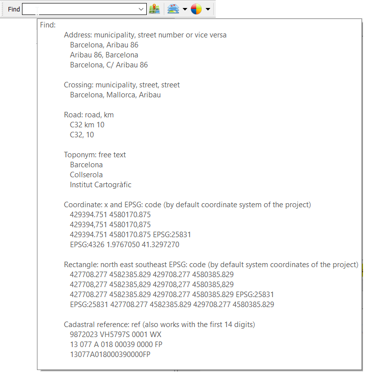
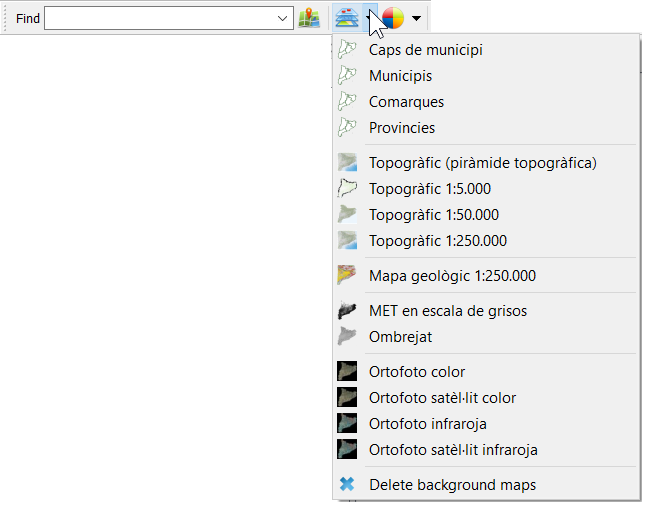
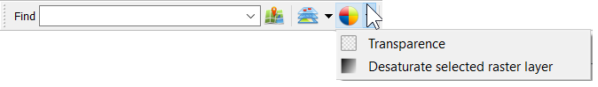

# Open ICGC plugin

QGIS Plugin for accessing [open data](http://www.icgc.cat/en/The-ICGC/Public-Information/Transparency/Re-use-of-the-information) published by the [ICGC](http://www.icgc.cat) (Institut Cartogràfic de Catalunya, Catalan Mapping Agency).

At the moment, it provides geocoding searches for place names, streets, roads, coordinates in different reference systems:

loading of base data layers:

and basic style control:

More data and services will be added in the near future.

This plugin uses [suds-py3](https://pypi.org/project/suds-py3/), [wsse](https://gist.github.com/copitux/5029872) libraries and spanish land registry [geo services](http://ovc.catastro.meh.es/ovcservweb/OVCSWLocalizacionRC/OVCCoordenadas.asmx?wsdl)
