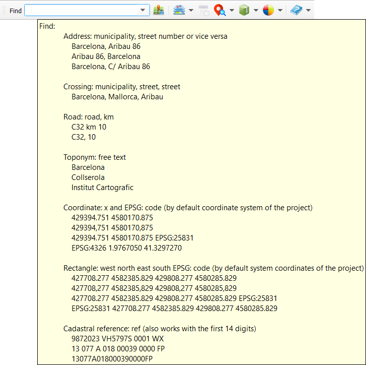
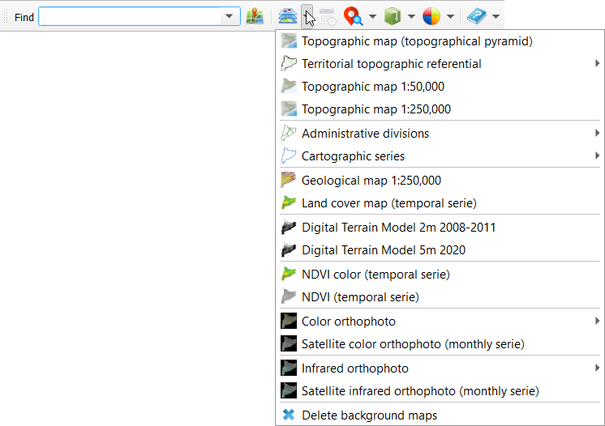

# Open ICGC plugin

QGIS Plugin for accessing [open data](https://www.icgc.cat/en/The-ICGC/Public-Information/Transparency/Re-use-of-the-information) published by the [ICGC](https://www.icgc.cat/en) (Institut Cartogràfic de Catalunya, Catalan Mapping Agency).

It provides geocoding searches for place names, streets, roads, coordinates in different reference systems:

loading of base data layers:

time series management:

search of historic raster photograms:

downloading of vectorial o raster information by area, municipality or county (depending on the product):

basic style control:

and show help:

More data and services will be added in the near future.

This plugin uses [suds-py3](https://pypi.org/project/suds-py3/), [wsse](https://gist.github.com/copitux/5029872) libraries and spanish land registry [geo services](https://ovc.catastro.meh.es/ovcservweb/OVCSWLocalizacionRC/OVCCoordenadas.asmx?wsdl)
